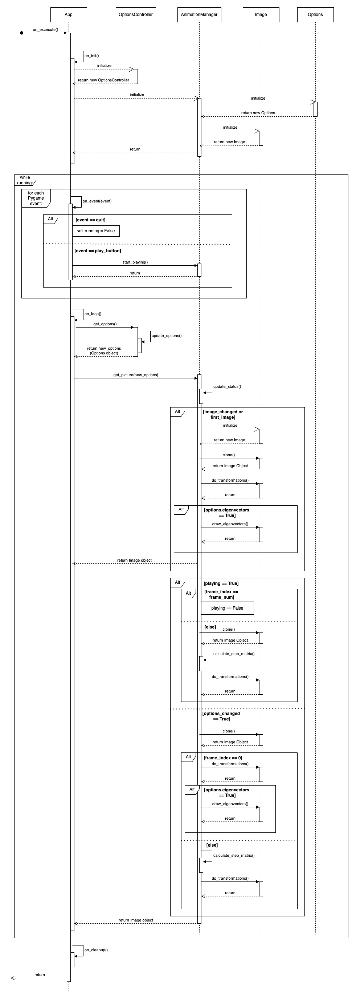

# Matrix-Transformation-Visualizer
This program will visualize linear transformations. Given an image and a 2x2 transformation matrix, the program will animate the transformation on the image. This project is inspired by 3Blue1Brown's Essence of Linear Algebra series: https://www.3blue1brown.com/topics/linear-algebra

Users can choose to display:
- x-y axis
- i-hat and j-hat
- the determinant
- eigenvectors
- grid lines

## How to run
$ pip3 install -r requirements.txt 
$ python3 ./app.py

### Adding Images
Please add images into the /images folder.
Any image type supported by OpenCV can be used:
- Windows bitmap (bmp)
- Portable image formats (pbm, pgm, ppm)
- Sun raster (sr, ras)
- JPEG (jpeg, jpg, jpe)
- JPEG 2000 (jp2)
- TIFF files (tiff, tif)
- Portable network graphics (png)

## UML - Sequence diagram
Below is the sequence diagram for the method App.on_excecute():

### Demo:

